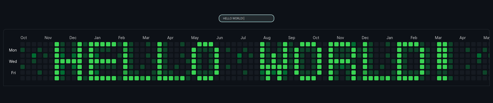

# Display Text as Contribution Graph 

A simple webpage to display text strings in the style of a GitHub contribution graph. 

Working example [here](https://www.markmote.com/text)




## About 

- Using Next.js and tailwindcss, bootstrapped with `create-next-app`
- Characters are embedded as 7x6 arrays in `characters.tsx` and `cleancharacters.tsx`
    - switch between the two by commenting/uncommenting lines at top of `page.jsx`

## Setup 

Install packages 
```
npm i 
```

Run locally: 
```
npm run dev
```
